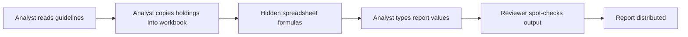
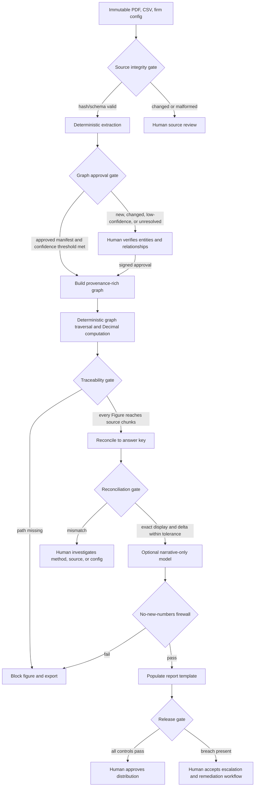

# Reporting flows, control gates, and audit events

## AS-IS flow

The current process mixes interpretation, calculation, copying, and commentary in one mutable workbook. Formula lineage is indirect, manual changes are hard to distinguish from calculations, and the reviewer cannot reliably replay a figure from an immutable source.

## TO-BE flow

## Gate criteria

| Gate | Auto-pass criterion | Human review criterion | Failure behavior |
|---|---|---|---|
| Source integrity | Exact approved SHA-256, expected schema, readable pages/rows | Any source replacement, schema drift, or unreadable content | Stop before graph construction |
| Extracted graph approval | Checked-in approval is `APPROVED`; manifest hash matches; every chunk confidence is at least 0.95; identifying terms still occur on the cited page; every holding asset class resolves | First ingestion, any extracted entity/edge change, confidence below 0.95, or unresolved ontology term | Stop; no unapproved graph can compute a figure |
| Traceability | Every Figure node has one or more graph paths terminating in SourceChunk nodes, with both guidelines and holdings represented | A path exists but is semantically disputed | Return an error for the figure and block export |
| Reconciliation | Display fields match exactly and raw delta is within the documented display-derived tolerance | Any mismatch, even within tolerance if display differs | Mark fail and withhold release |
| Narrative firewall | Narrative numeric-token set is a subset of deterministic output numeric tokens | A reviewer may rewrite commentary; rewritten text is checked again | Block report export |
| Release | Prior gates pass; audit chain verifies; report hash recorded | Any reported breach also requires the normal compliance escalation/approval | Do not distribute automatically |

The sample's `config/extraction_approval.json` represents the required human approval of the synthetic fixture. Changing one byte in the extraction manifest invalidates that approval and forces review.

## LLM versus deterministic boundary

| Concern | Deterministic only | LLM permitted |
|---|---|---|
| PDF/CSV hashes and extraction validation | Yes | No |
| Graph nodes, edges, provenance, and entity resolution | Yes, with human approval | May propose candidates in a future ingestion UI, never approve them |
| NAV, allocation, utilization, breach status, concentration, liquidity, duration, DV01 | Yes | No |
| Rounding, truncation, formatting, reconciliation deltas | Yes | No |
| Report numeric cells and citations | Yes | No |
| Qualitative commentary | Default deterministic; optional model | Yes, downstream and firewall checked |

There is no callable interface from the narrative module to the computation module. The narrative receives an immutable serialization after figures are finalized; only its text is returned. It cannot write graph state, audit state, expected values, or workbook numeric cells.

## Audit event catalogue

The SQLite row plus its hash-chain fields are retained for at least seven years. Events attached to investor-facing exported reports inherit the ten-year report retention requirement. Production storage would apply the longer applicable policy and WORM enforcement.

| Event | Trigger | Data captured | Retention |
|---|---|---|---|
| `CONFIGURATION_ACTIVATED` | A firm run begins | Firm ID and configuration SHA-256 | 7 years |
| `CONFIGURATION_CHANGED` | Active firm differs from prior run | Prior/new firm IDs and new config hash | 7 years |
| `GRAPH_CONSTRUCTION_STARTED` | Source validation begins | Guidelines and holdings hashes | 7 years |
| `GRAPH_CONSTRUCTION_COMPLETED` | Approved graph built | Node/edge counts, pre-figure graph hash, approval status | 7 years |
| `FIGURE_COMPUTED` | Deterministic engine emits a figure | Raw/display value, formula, config rule, input node IDs, path count | 10 years with report |
| `TRACEABILITY_CHECKED` | All figures are traversed to source | Pass/fail and count | 10 years with report |
| `RECONCILIATION_COMPLETED` | Comparison to answer key finishes | Pass/fail, count, failed figure IDs | 10 years with report |
| `NARRATIVE_FIREWALL_CHECKED` | Commentary is ready | Provider/model, pass/fail, unexpected tokens | 10 years with report |
| `REPORT_EXPORTED` | Workbook bytes are written | Firm, path, report SHA-256, reconciliation status | 10 years with report |

Each row stores the prior row hash and its own SHA-256. SQLite triggers reject `UPDATE` and `DELETE`; application code exposes only `append`. The test suite proves both triggers by issuing direct SQL.
