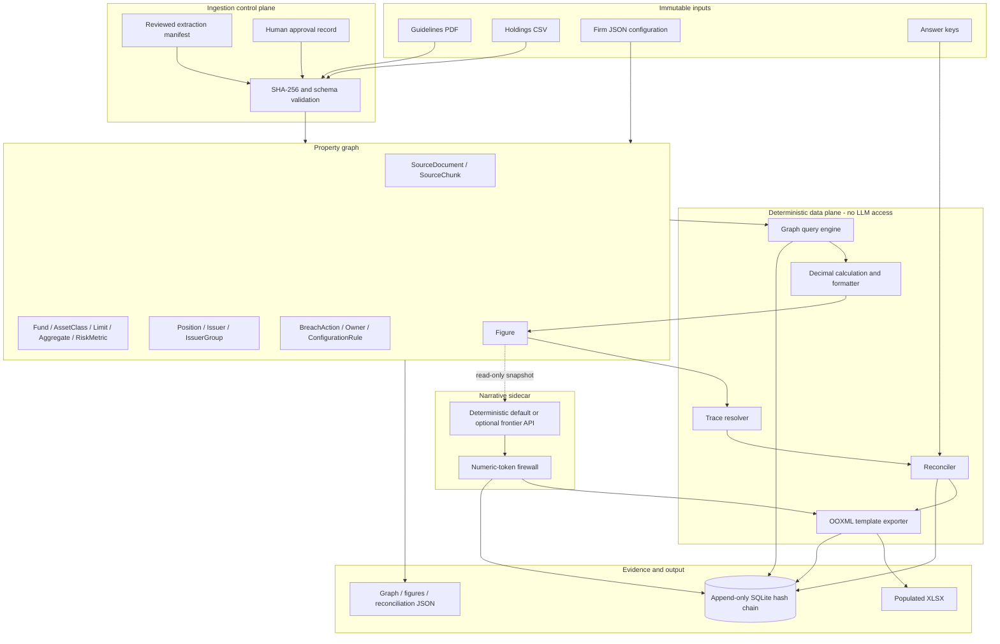
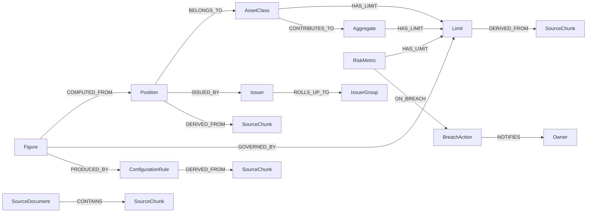

# Architecture



## Graph model



Every rectangle is a property-graph node. Every node and edge has the same provenance envelope:

```json
{
  "source_document": "sample_fund_guidelines.pdf",
  "page": 2,
  "chunk_id": "chunk:concentration_p2",
  "ingested_at": "2026-08-24T00:00:00Z",
  "extraction_confidence": 0.99,
  "source_sha256": "..."
}
```

The graph is not decorative. Computation discovers a position's asset class through `BELONGS_TO`, limits through `HAS_LIMIT`, liquid/non-IG contributors through `CONTRIBUTES_TO`, and figure evidence through Figure-originating traversals. Export is impossible until each Figure reaches SourceChunk nodes.

## Module boundaries

| Module | Responsibility | May produce reported numbers? |
|---|---|---|
| `extraction.py` | Approval gate and graph construction | Source values only |
| `graph.py` | Provenance-aware storage and traversal | No |
| `computation.py` | Decimal calculations, status, and formatting | Yes - sole authority |
| `reconciliation.py` | Answer-key comparison and trace checks | Deltas only |
| `narrative.py` | Commentary and firewall | No |
| `xlsx.py` | Copy computed strings into fixed template cells | No calculation |
| `audit.py` | Append-only evidence | No |
| `pipeline.py` | Ordered gates and fail-closed orchestration | No calculation |
